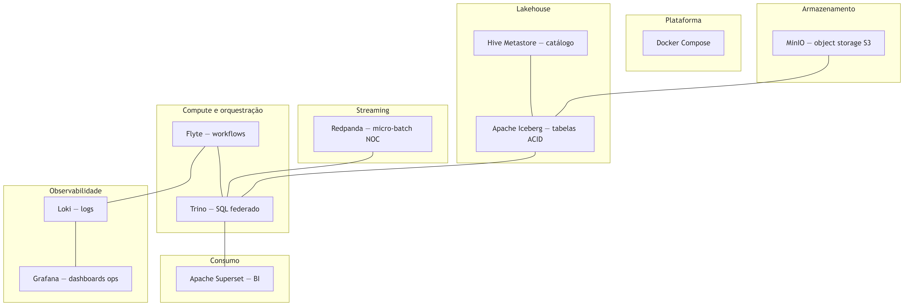
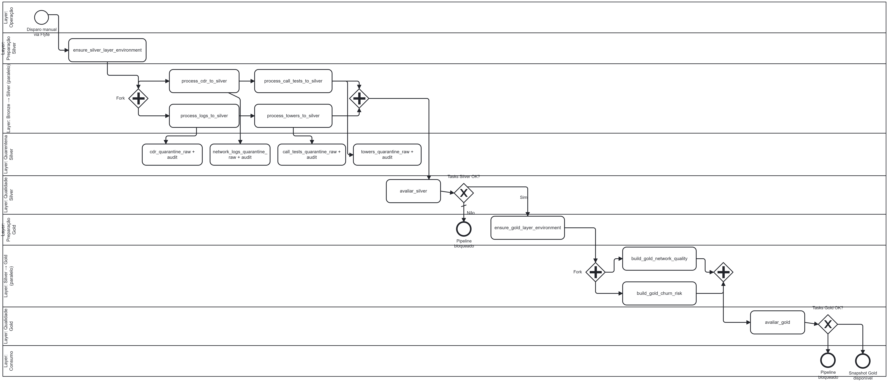
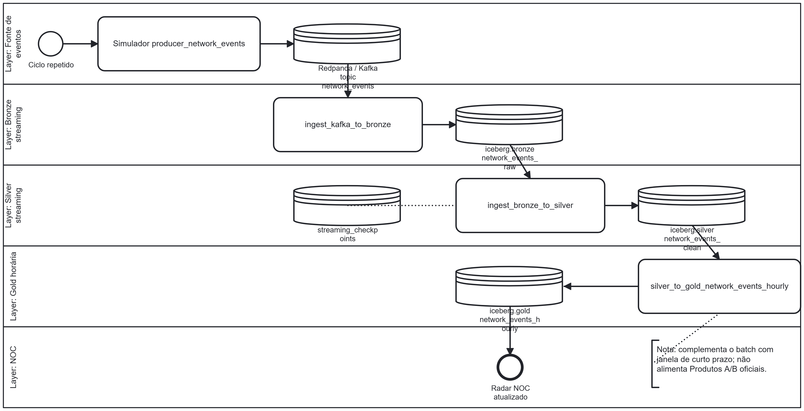

# TEAD 2.0 — Stack local de dados

Lakehouse **batch** (CSV → Iceberg → Gold), **streaming** (Kafka/Redpanda) e consumo BI, com **Flyte** e **Docker Compose**.

Repositório: https://github.com/danyraimundo97-bit/Tead-Project

---

## 1. Subir a stack

### Pré-requisitos

- Docker Engine 20.10+ e Docker Compose v2
- ~8 GB RAM, ~10 GB disco
- Python 3.10+ (producer e scripts no host)

```bash
git clone https://github.com/danyraimundo97-bit/Tead-Project.git
cd Tead-Project
docker compose up -d --build
docker compose ps
docker compose exec trino trino --execute "SHOW CATALOGS;"
```

Catálogos esperados: `iceberg`, `hive`, `kafka`, `system`.

```bash
docker compose down        # mantém volumes
docker compose down -v     # reset total
```

### Portas

| Serviço | URL | Credenciais |
|---------|-----|-------------|
| MinIO API | http://localhost:9000 | `minioadmin` / `minioadmin` |
| MinIO Console | http://localhost:9001 | 
| Trino | http://localhost:8080 | sem auth |
| Redpanda (Kafka) | `localhost:19092` | — |
| Grafana | http://localhost:3000 |  Admin |
| Loki | http://localhost:3100 | — |
| Superset | http://localhost:8088 | `admin` / `admin` |
| Flyte Console | http://localhost:30080 | sandbox |

Tasks Flyte no host acedem ao Compose via `host.docker.internal` (MinIO `9000`, Trino `8080`, Loki `3100`).

---

## 2. Flyte (sandbox)

**Windows (PowerShell):**

```powershell
$env:DOCKER_API_VERSION="1.44"
flytectl demo start --image cr.flyte.org/flyteorg/flyte-sandbox-bundled:latest
```

**Linux / macOS:** mesma imagem; em Linux pode ser necessário `--add-host host.docker.internal:host-gateway` no sandbox.

Registar workflows (sempre que alterar código em `flyte-workflows/`):

```bash
pyflyte register flyte-workflows/
```

Variáveis usadas pelas tasks (MinIO):

```text
MLFLOW_S3_ENDPOINT_URL=http://host.docker.internal:9000
AWS_ACCESS_KEY_ID=minioadmin
AWS_SECRET_ACCESS_KEY=minioadmin
```

---

## 3. Ordem de execução dos workflows

### Caminho A — Batch (obrigatório para Produtos Gold A/B)

| Ordem | Ação | Ficheiro | Quando |
|-------|------|----------|--------|
| 0 | **`setup_raw_data`** | `setup_raw_data.py` | Landing zone vazia: envia os CSV de `datasets/Datasets_Raw/` para `s3://warehouse/Dados_Raw/` |
| 1 | `ingestion_workflow` | `flyte-workflows/raw_bronze_workflow.py` | Bronze MinIO vazio: lê `Dados_Raw` no S3 e escreve bronze (simulação Leiria) |
| 2 | **`jdpt_lakehouse_pipeline`** | `flyte-workflows/workflow.py` | Silver + Gold (snapshot completo) |

O passo **1 não faz upload** dos ficheiros raw: assume que já estão no MinIO (passo 0 ou upload anterior). Se `Dados_Raw` já existir no bucket, **saltar o passo 0**. Se o bronze já estiver em `s3://warehouse/bronze/` (partições `day=*/data.csv`), **saltar o passo 1**.

```bash
# Pré-requisito: stack Docker a correr (secção 1) e Flyte sandbox (secção 2)
pip install boto3
python setup_raw_data.py

pyflyte register flyte-workflows/

# Opcional — só se bronze estiver vazio (requer Dados_Raw no MinIO)
pyflyte run --remote flyte-workflows/raw_bronze_workflow.py ingestion_workflow

# Pipeline principal batch
pyflyte run --remote flyte-workflows/workflow.py jdpt_lakehouse_pipeline
```

**Reset gold** (após mudar particionamento Iceberg):

```bash
pyflyte run --remote flyte-workflows/clean_gold_layer.py reset_gold_workflow
pyflyte run --remote flyte-workflows/workflow.py jdpt_lakehouse_pipeline
```

### Caminho B — Streaming (independente do batch; NOC em tempo quase real)

| Ordem | Ação | Detalhe |
|-------|------|---------|
| 1 | DDL streaming | Executar `sql_scripts/setup_streaming_tables.sql` no Trino (`http://localhost:8080`) |
| 2 | Producer | `python python_scripts/producer_network_events.py` (broker `localhost:19092`) |
| 3 | **`jdpt_streaming_full_sync`** | `flyte-workflows/streaming_full_sync.py` |
| 4 | (opcional) `jdpt_streaming_quality_check` | `flyte-workflows/avaliar_streaming.py` |

**Limpar tabelas streaming** (só `network_events_*` e checkpoints; batch intacto):

```bash
# SQL rápido no Trino (apaga linhas, mantém tabelas)
# sql_scripts/clean_streaming_tables.sql

# Reset completo (DROP + MinIO + recria DDL)
pyflyte run --remote flyte-workflows/clean_streaming_tables.py reset_streaming_workflow
```

```bash
pip install -r python_scripts/requirements.txt
python python_scripts/producer_network_events.py

pyflyte register flyte-workflows/
pyflyte run --remote flyte-workflows/streaming_full_sync.py jdpt_streaming_full_sync
pyflyte run --remote flyte-workflows/avaliar_streaming.py jdpt_streaming_quality_check
```

Validar Kafka no Trino:

```sql
SELECT * FROM kafka.default.network_events LIMIT 10;
```

---

## 4. Diagramas e figuras

Pasta `docs/Relatório/figuras/` (também usadas em `docs/Relatório/main.tex`). Pré-visualização em Markdown: ``.

### Arquitetura



### Tabelas batch


### BPMN batch — `jdpt_lakehouse_pipeline`



### BPMN streaming — `jdpt_streaming_full_sync`



### Tabelas streaming


Para alterar os diagramas, ver `docs/diagrams/lakehouse-tables-streaming.mmd`, `lakehouse-tables-batch.mmd` e `docs/diagrams/*.bpmn`.

---

## 5. Grafana — importação e configuração

**Export:** `docs/Dashboards/dashboard-grafana.json`

**Importar:**

1. http://localhost:3000 → **Dashboards → New → Import**
2. Carregar `docs/Dashboards/dashboard-grafana.json`
3. Datasource **Loki**: **Connections → Data sources → Add → Loki** → URL `http://loki:3100` (dentro do Compose)

**Producer e tasks** enviam logs para `http://localhost:3100/loki/api/v1/push` (host) ou `http://host.docker.internal:3100` (pods Flyte). Label: `application=tead`.

Queries úteis no **Explore**:

```logql
{application="tead", module="producer_network_events"} |= "event_sent"
{application="tead"} |= "table_insert" |= "phase=complete"
{application="tead", module="avaliar_streaming"} |= "Streaming QA: ALERTA"
```

Arrancar só observabilidade: `docker compose up -d loki grafana`

---

## 6. Superset — ligação e exportação

**URL:** http://localhost:8088 (`admin` / `admin`)

**Ligação Trino (dentro da rede Docker):**

| Campo | Valor |
|-------|-------|
| SQLAlchemy URI | `trino://flyte@trino:8080/iceberg` |
| (referência no repo) | `trino_uri_superset.txt` |

Registar datasets sobre `iceberg.gold.network_quality_daily`, `iceberg.gold.churn_risk_daily` e, se usar streaming, `iceberg.gold.network_events_hourly`.

**Exportar dashboard:** UI Superset → dashboard → **⋯ → Export** → guardar JSON em `docs/Dashboards/` (convenção do projeto).

**Build Superset:** `superset/Dockerfile` (driver Trino incluído); sobe com `docker compose up -d superset`.

---

## 7. Documentação e contratos (ficheiros no repo)

| Artefacto | Caminho |
|-----------|---------|
| Relatório LaTeX | `docs/Relatório/main.tex` |
| Limpeza Silver (apoio relatório) | `docs/Relatório/Ficheiro de limpeza da camada silver.md` |
| Construção Gold | `docs/Relatório/Ficheiro de construção da camada gold.md` |
| Data Products / Contratos v1 | `docs/Data_Products - Data_Contracts/v1/` |
| Data Products / Contratos v2 | `docs/Data_Products - Data_Contracts/v2/` |

---

## 8. Datasets

| Pasta | Conteúdo |
|-------|----------|
| `datasets/Datasets_Raw/` | CSV originais + `pipeline_raw_bronze.py`, `simular_tempestade.py` |
| `datasets/Datasets_Bronze_Leiria/` | Bronze Leiria (CSV) + `prepare_data.py` |
| `datasets/Datasets_Silver/` | Exemplos silver exportados (CSV) |

Bronze no MinIO para o batch: prefixos `warehouse/bronze/cdr_customers/`, `network_logs/`, `call_tests/`, `towers/`.

---

## 9. Scripts Python

| Script | Função |
|--------|--------|
| `setup_raw_data.py` | Upload dos 4 CSV raw de `datasets/Datasets_Raw/` → `s3://warehouse/Dados_Raw/` (MinIO `localhost:9000`) |
| `python_scripts/producer_network_events.py` | Eventos sintéticos → tópico `network_events` |
| `python_scripts/requirements.txt` | Dependências (`kafka-python`, `python-logging-loki`, …) |

Opções do producer: `--no-nulls`, `--no-loki`, `--broker localhost:19092`.

---

## 10. SQL e catálogos Trino

| Ficheiro | Uso |
|----------|-----|
| `sql_scripts/setup_streaming_tables.sql` | Tabelas bronze/silver/gold streaming |
| `sql_scripts/clean_streaming_tables.sql` | Apagar dados streaming (Trino) |
| `flyte-workflows/clean_streaming_tables.py` | Reset streaming (DROP + MinIO + DDL) |
| `trino/etc/catalog/iceberg.properties` | Catálogo Iceberg |
| `trino/etc/catalog/kafka.properties` | Catálogo Kafka → Redpanda |
| `trino/etc/kafka/network_events.json` | Schema tópico `network_events` |

---

```bash
docker compose logs -f trino
docker compose logs -f grafana
```

---

## Aviso de segurança

Credenciais por defeito (`minioadmin`, `admin/admin`) e portas em `localhost`. Não expor em redes públicas.
