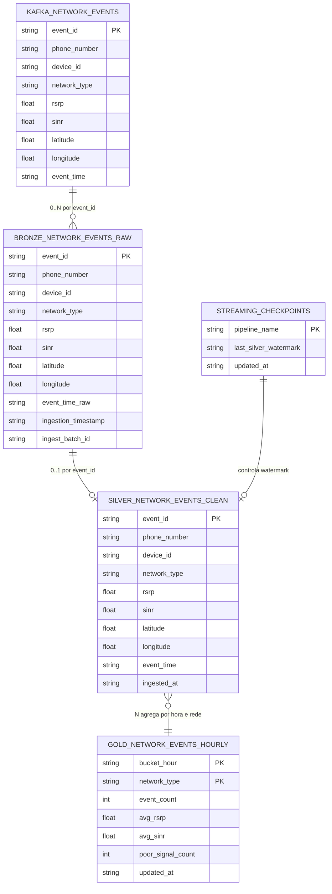
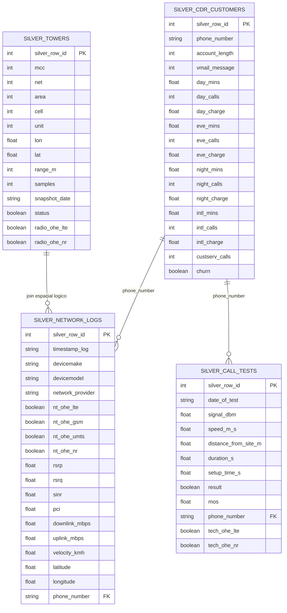
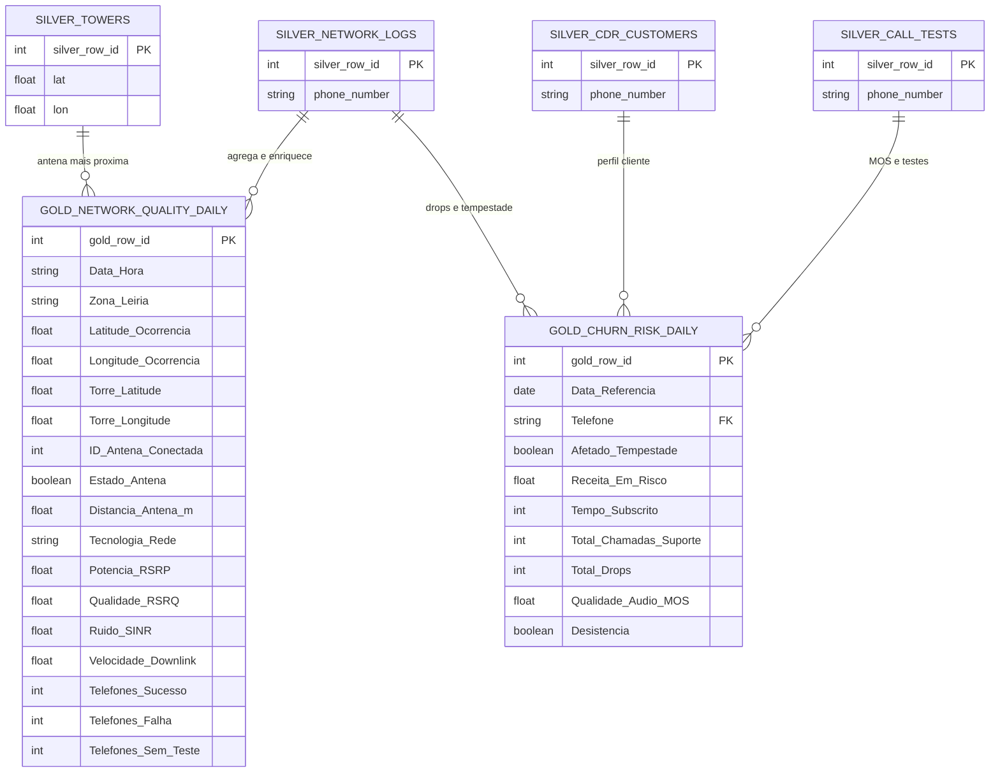
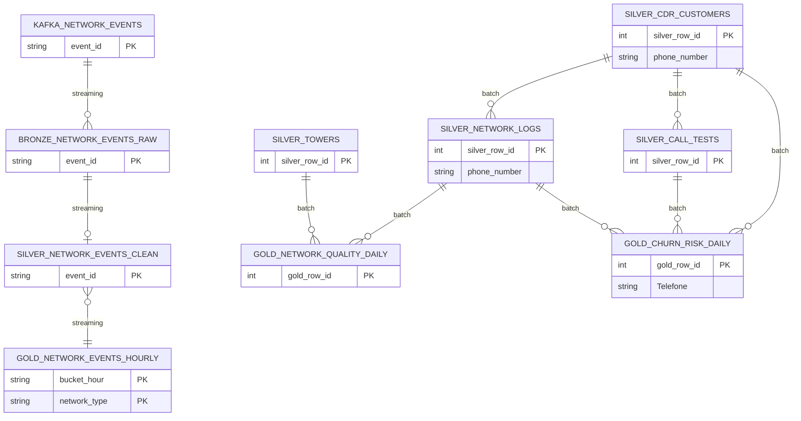

# Tead Lakehouse — Diagrama ER (entidade–relação)

Diagramas **só de tabelas** (atributos + cardinalidade). Para fluxos Kafka/Flyte ver [lakehouse_tables.md](lakehouse_tables.md).

**Render:** preview deste `.md` no Cursor, ou colar um `.mmd` de [diagrams/](diagrams/) em [mermaid.live](https://mermaid.live) (só o conteúdo do ficheiro, sem `#`).

---

## 1. Streaming — ER completo

Catálogos: `kafka` (tópico) → `iceberg.bronze` → `iceberg.silver` → `iceberg.gold`.

| Entidade | Schema | Persistência |
|----------|--------|----------------|
| `KAFKA_NETWORK_EVENTS` | `kafka.default` | Redpanda (não MinIO) |
| `BRONZE_NETWORK_EVENTS_RAW` | `iceberg.bronze` | Parquet MinIO |
| `STREAMING_CHECKPOINTS` | `iceberg.bronze` | Parquet MinIO |
| `SILVER_NETWORK_EVENTS_CLEAN` | `iceberg.silver` | Parquet MinIO |
| `GOLD_NETWORK_EVENTS_HOURLY` | `iceberg.gold` | Parquet MinIO |

---

## 2. Batch — ER silver (domínio telecom)

> `phone_number` é unique no negócio após dedup; FK = ligação lógica (sem constraint Iceberg).

---

## 3. Batch — ER gold (data products)

---

## 4. Vista global (streaming + batch, só entidades principais)

---

## Legenda ER

| Notação | Significado |
|---------|-------------|
| `PK` | Chave primária (ou natural key no streaming) |
| `FK` | Chave estrangeira **lógica** (MERGE / join; Iceberg não impõe FK) |
| `UK` | Unique no modelo de negócio após transformação |
| `\|\|--o{` | 1 para N |
| `\|\|--o\|` | 1 para 0..1 |
| `}o--\|\|` | N para 1 (muitos eventos → uma linha agregada gold) |

Ficheiros Mermaid só-ER: [streaming-er.mmd](diagrams/streaming-er.mmd), [batch-er.mmd](diagrams/batch-er.mmd), [batch-er-silver.mmd](diagrams/batch-er-silver.mmd), [batch-er-gold.mmd](diagrams/batch-er-gold.mmd), [lakehouse-er-overview.mmd](diagrams/lakehouse-er-overview.mmd).
