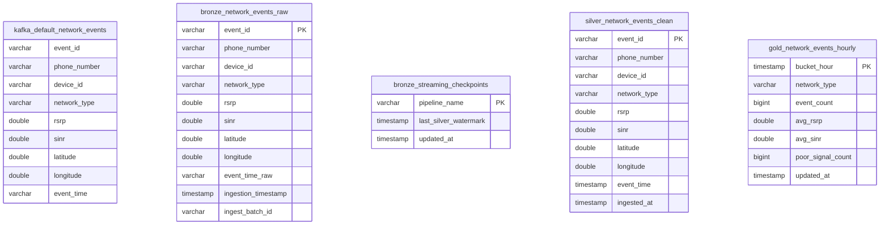

# Tabelas do Lakehouse JDPT (Mermaid)

Dois diagramas **só com tabelas e colunas** (sem relações). Colar cada bloco em [mermaid.live](https://mermaid.live).

Ficheiros fonte: [`diagrams/lakehouse-tables-batch.mmd`](diagrams/lakehouse-tables-batch.mmd), [`diagrams/lakehouse-tables-streaming.mmd`](diagrams/lakehouse-tables-streaming.mmd).

---

## Fluxo 1 — Batch (`jdpt_lakehouse_pipeline`)

Bronze = CSV em `s3://warehouse/bronze/` · Silver/Gold = Iceberg (`iceberg.silver`, `iceberg.gold`).

```mermaid
erDiagram
    minio_bronze_cdr_customers {
        string phone_number
        string churn
        string day_charge
        string eve_charge
    }

    minio_bronze_network_logs {
        string timestamp
        string phone_number
        string rsrp
        string latitude
        string longitude
    }

    minio_bronze_call_tests {
        string date_of_test
        string phone_number
        string mos
        string call_test_result
    }

    minio_bronze_towers {
        string radio
        int mcc
        int cell
        string lat
        string lon
        string status
    }

    silver_cdr_customers {
        bigint silver_row_id PK
        varchar phone_number
        int account_length
        int vmail_message
        double day_mins
        int day_calls
        double day_charge
        double eve_mins
        int eve_calls
        double eve_charge
        double night_mins
        int night_calls
        double night_charge
        double intl_mins
        int intl_calls
        double intl_charge
        int custserv_calls
        boolean churn
    }

    silver_network_logs {
        bigint silver_row_id PK
        timestamp timestamp_log
        varchar devicemake
        varchar devicemodel
        varchar network_provider
        boolean nt_ohe_lte
        boolean nt_ohe_gsm
        boolean nt_ohe_umts
        boolean nt_ohe_nr
        boolean nt_ohe_cdma
        boolean nt_ohe_other
        double rsrp
        double rsrq
        double sinr
        double pci
        double downlink_mbps
        double uplink_mbps
        double velocity_kmh
        double latitude
        double longitude
        varchar phone_number
    }

    silver_call_tests {
        bigint silver_row_id PK
        timestamp date_of_test
        double signal_dbm
        double speed_m_s
        double distance_from_site_m
        double duration_s
        double setup_time_s
        boolean result
        double mos
        varchar phone_number
        boolean tech_ohe_gsm
        boolean tech_ohe_umts
        boolean tech_ohe_lte
        boolean tech_ohe_volte
        boolean tech_ohe_nr
        boolean tech_ohe_other
    }

    silver_towers {
        bigint silver_row_id PK
        int mcc
        int net
        int area
        int cell
        bigint unit
        double lon
        double lat
        int range_m
        int samples
        int changeable
        varchar created
        varchar updated
        double average_signal
        varchar snapshot_date
        boolean status
        boolean radio_ohe_gsm
        boolean radio_ohe_umts
        boolean radio_ohe_lte
        boolean radio_ohe_nr
        boolean radio_ohe_cdma
        boolean radio_ohe_other
    }

    gold_network_quality_daily {
        bigint gold_row_id PK
        timestamp Data_Hora
        varchar Zona_Leiria
        double Latitude_Ocorrencia
        double Longitude_Ocorrencia
        double Torre_Latitude
        double Torre_Longitude
        bigint ID_Antena_Conectada
        boolean Estado_Antena
        double Distancia_Antena_m
        varchar Tecnologia_Rede
        double Potencia_RSRP
        double Qualidade_RSRQ
        double Ruido_SINR
        double Velocidade_Downlink
        bigint Telefones_Sucesso
        bigint Telefones_Falha
        bigint Telefones_Sem_Teste
    }

    gold_churn_risk_daily {
        bigint gold_row_id PK
        date Data_Referencia
        varchar Telefone
        boolean Afetado_Tempestade
        double Receita_Em_Risco
        int Tempo_Subscrito
        int Total_Chamadas_Suporte
        bigint Total_Drops
        double Qualidade_Audio_MOS
        boolean Desistencia
    }
```

**Gold — grão:** `network_quality_daily` → torre × dia · `churn_risk_daily` → telefone × dia.

---

## Fluxo 2 — Streaming (`jdpt_streaming_full_sync`)

**Gold — grão:** `network_events_hourly` → `bucket_hour` + `network_type`.
