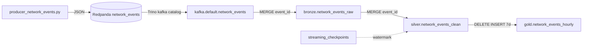
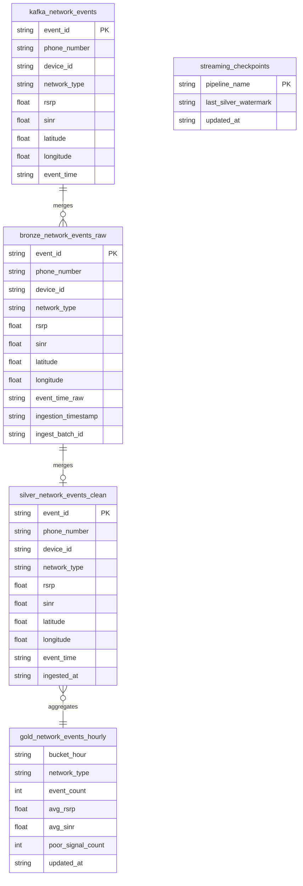
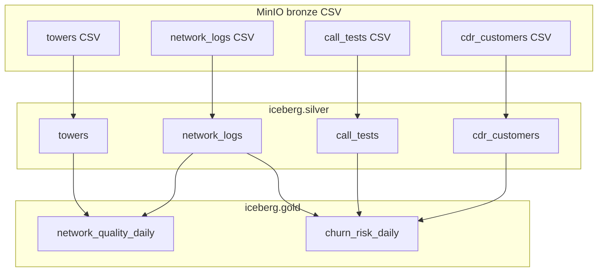
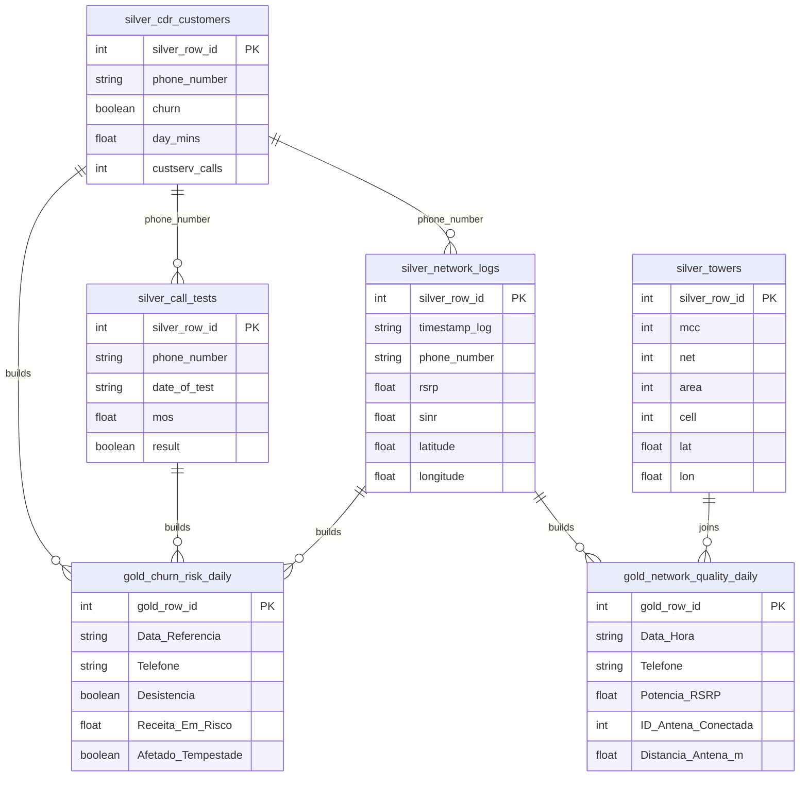

# Tead Lakehouse — Fluxos de dados (Mermaid)

**Diagramas ER (entidade–relação):** ver **[lakehouse_er.md](lakehouse_er.md)** — é o documento principal para tabelas, PK/FK e cardinalidade.

Fontes: `sql_scripts/setup_streaming_tables.sql`, `flyte-workflows/ensure_pipeline_layers.py`

> **Como renderizar:** preview Markdown no Cursor, ou cola um `.mmd` em [mermaid.live](https://mermaid.live) (não coles o `.md` inteiro).

Ficheiros `.mmd`:

| Fluxo | ER |
|-------|-----|
| [streaming-flow.mmd](diagrams/streaming-flow.mmd) | [streaming-er.mmd](diagrams/streaming-er.mmd) |
| [batch-flow.mmd](diagrams/batch-flow.mmd) | [batch-er.mmd](diagrams/batch-er.mmd), [batch-er-silver.mmd](diagrams/batch-er-silver.mmd), [batch-er-gold.mmd](diagrams/batch-er-gold.mmd) |
| — | [lakehouse-er-overview.mmd](diagrams/lakehouse-er-overview.mmd) |

## Streaming — fluxo de dados

## Streaming — modelo de tabelas

> `kafka.default.network_events` não é Iceberg — tópico Redpanda (`trino/etc/kafka/network_events.json`).  
> `streaming_checkpoints` guarda watermark (ver fluxo acima). PK composta em gold: `(bucket_hour, network_type)`.

## Batch — fluxo (Medallion CSV)

## Batch — modelo de tabelas (principais)

## Legenda

| Símbolo / termo | Significado |
|-----------------|-------------|
| PK | Chave primária ou natural (`event_id`; gold: `bucket_hour` + `network_type`) |
| MERGE | Escrita idempotente no streaming |
| Linha tracejada (fluxo) | Metadata / watermark, sem FK no Iceberg |
| phone_number | Relação lógica entre tabelas batch |
